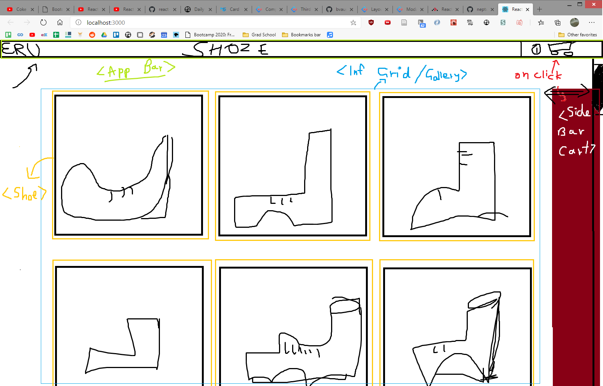

# Mockup



- ## Inspirations

  - [Nike](https://www.nike.com/launch)
  - [Adidas](https://www.adidas.com/us/men-shoes)
  - [Reebok](https://www.reebok.com/us/men-shoes)
  - [Puma](https://us.puma.com/en/us/men/shoes)

- ## Our version

  - Main flat display like Nike (**Infinite scrolling Grid, add load more button? or keep it autoload? The load more button is for cases where we care about the user being able to access the footer, since we have no footer we dont care.**).
        
  - On hover popout card like adidas and rebok
        
  - OnClick modal like puma quickview.
        
  - Cart button sidebar slide in and Add to cart modal show like puma:
            

- ## Software decisions

  - maybe serve images in next-gen formats like WebP, JPEG2000, JPEGXR??
  - Which UI Libraries can we use?
    - [Ant-Design](https://ant.design/components/overview/)
    - [Material UI](https://material-ui.com/)
    - fragmented UI components that fill a single purpose?
      - [Main List](https://github.com/brillout/awesome-react-components)
      - [Modal: react-skylight](http://marcio.github.io/react-skylight/)
      - [Infinite scroll grid](https://github.com/naver/egjs-infinitegrid/tree/master/packages/react-infinitegrid)
      - [react-toastify notification](https://fkhadra.github.io/react-toastify/introduction/)
      - [react-burger-menu sidebar](https://negomi.github.io/react-burger-menu/)
      - [react-intense superzoom](https://react-intense.bryce.io/)
      - [react-flexbox-grid](https://github.com/roylee0704/react-flexbox-grid) can be used for responsive layouts with the xs=12, md=6 lg=4
  - We should add the On click modal thing on the 2nd component that only displays when we are on the hover state, this is coz the mobile ppl cant hover and they have to click once to go into the hover state and then click again to get the modal? lol
  - random snippets
    - Hover component change:
      - [SO](https://stackoverflow.com/questions/44566340/show-a-component-on-hover-in-reactjs) [sandbox example](https://codesandbox.io/s/XopkqJ5oV?file=/index.js)

```javascript
import React, { Component } from "react";
import { render } from "react-dom";

class HoverExample extends Component {
  constructor(props) {
    super(props);
    this.handleMouseHover = this.handleMouseHover.bind(this);
    this.state = {
      isHovering: false
    };
  }

  handleMouseHover() {
    this.setState(this.toggleHoverState);
  }

  toggleHoverState(state) {
    return {
      isHovering: !state.isHovering
    };
  }

  render() {
    return (
      <div>
        {!this.state.isHovering && (
          <div
            onMouseEnter={this.handleMouseHover}
            onMouseLeave={this.handleMouseHover}
          >
            Hover Me
          </div>
        )}
        {this.state.isHovering && (
          <div
            onMouseEnter={this.handleMouseHover}
            onMouseLeave={this.handleMouseHover}
          >
            Hovering right meow!
          </div>
        )}
      </div>
    );
  }
}

render(<HoverExample />, document.getElementById("root"));
```

- ## Css stuff
  
  - Can overlay text on image by using absolute positioning and then spacing it from the margins by fixed amounts.

  - Selecting all img elements with "poop" class is done using `img.poop {}`. Selecting all img elements that are inside containers / are descendants of containers with class "poop" is done by `.poop img {}`
  
  - Object placement along the main flexbox direction is done by first setting everything with `justify-contents:flex-end` etc and then using `margin: auto` and its variants like `margin-left: auto` on the children for specific placement. Object placement along the cross axis inside flexbox is done by using `align-self: auto`. There is an [Amazing demonstration of flexbox alignment on SO](https://stackoverflow.com/questions/32551291/in-css-flexbox-why-are-there-no-justify-items-and-justify-self-properties/33856609#33856609)

  - The hover whitening effect on images is added by simply changing the `opacity: 0.6` or something and then making it look smooth by adding a `transition: 0.5s ease`

  - Negative margins allow you to make items overlap. We used this in the Shoe-details modal to make the price get close to the heading name of the shoe by setting `margin-bottom: -1rem;` for the header.

  - To enable fallbacks with next-gen image formats like webP we use `<picture>` elements with multiple `<source>` elements. However this will not render unless there is also an included `` element inside it with a basic src like jpeg etc. This sort of enforces backwards compatibility by simply not allowing us to use picture without an img element since some browsers may not support picture.

  - Css transition is a way to add an interpolation to a css property. its like a watcher that observes a css property and then when it changes, it displays that change as the transition we defined like `transition: transform 1s` will watch the transform property of any css object and if the transform changes then it will change over 1s interpolated by whatever default transition function is there. We used this to make our sidebar smoothly display and hide itself by telling transition to watch the transform property which we change by translateX(200px) and from its standard position.

  - [Good explanation on w3schools](https://www.w3schools.com/css/css_positioning.asp). Css positioning is also pretty nice, we can use fixed,static,relative, absolute and sticky. static is the default and it just goes with normal html flow. relative is also the same as normal but we can assign it different values to offset it from the normal of the static value. Fixed positions the element relative to the viewport and u can read the rest from w3 lol.

  - Add a scroll bar to html elements by simply adding `overflow-y: auto`.

- ## Debugging / quirks

  - React Strict Mode causes component double rendering when using hooks.

  - DO NOT PUT COMPONENTS INSIDE STATE. I put a list of components to be rendered by the grid into a list and they had messed up closures. Basically whatever the closure was at the time of adding them to state was what they kept regardless of the state that they depended on changing. This was a problem with the Shoe item inside the grid and when I pressed the add to cart button it always resetted app state to what it was when the Shoe component was added to the list state.

## TODO Maybe

- Animate the gender stick figures.
- [x] Implement Cart sidebar
- [ ] Add the dota shop sound on cart sidebar.
